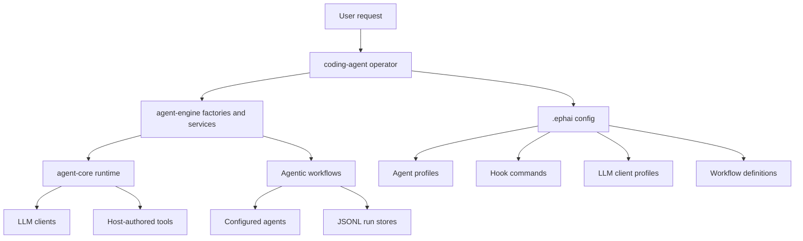

# Ephemeral Agent

Ephemeral Agent is a TypeScript workspace for building agentic coding systems
without mixing runtime mechanics, host policy, and product configuration into one
layer. The repository is split into a mechanism-only SDK, an engine layer that
adds reusable host services, and a configured coding-agent host that wires
profiles, workflows, hooks, run records, and sandbox tools together.

The packages are private pre-release workspace packages (`0.0.0`) consumed as
TypeScript source. The project is ESM-only, package-managed with pnpm, and built
around typed tools, typed terminal outcomes, deterministic tests, and JSONL run
records.

## What This Repository Owns

| Package | Role | Owns |
| --- | --- | --- |
| `@ephai/agent-core` | Mechanism-only SDK | Agent loop, provider turns, tool execution, hooks, background tasks, notifications, typed outcomes, run handles, testkit, and JSONL records. It ships no tools and no policy. |
| `@ephai/agent-engine` | Host service layer | Agent factories, advisory outcome helpers, agentic workflow factories, workflow tool services, JSONL stores, and reusable model-visible tool implementations. |
| `@ephai/coding-agent` | Product host | `.ephai` config loading, operator bootstrap, sandbox tools, hook command wiring, agent profiles, and configured workflows such as `pursuit` and `ralph_loop`. |

## Architecture



The central contract is deliberately narrow:

- `agent-core` executes runs but does not know product-specific tools, prompts,
  gates, workflows, or subprocess behavior.
- Host packages author tools with `defineTool`, terminal outcomes with
  `createAgentOutcomeFn`, and hooks with ordinary callbacks.
- `agent-engine` turns those primitives into higher-level agent and workflow
  services while keeping storage and context surfaces explicit.
- `coding-agent` is the composition root: it parses config, builds the runtime,
  loads workflow modules, injects sandbox tools, and returns an operator agent.

## Repository Layout

```text
.
|-- package.json
|-- pnpm-workspace.yaml
`-- packages
    |-- agent-core
    |   |-- src/agents
    |   |-- src/agents/llm-client
    |   |-- src/agents/tool
    |   |-- src/nodes
    |   |-- src/agentic-workflows
    |   |-- testkit
    |   |-- tests
    |   `-- e2e
    |-- agent-engine
    |   |-- src/agents
    |   |-- src/agentic-workflows
    |   |-- src/runs
    |   |-- src/tools
    |   `-- tests
    `-- coding-agent
        |-- .ephai
        |-- src/bootstrap.ts
        |-- src/config
        |-- src/sandbox
        |-- src/tools
        `-- tests
```

## Quick Start

Prerequisites:

- Node.js with modern ESM support.
- `pnpm@10.23.0` or Corepack configured to use the package manager pinned in
  `package.json`.

Install dependencies:

```bash
pnpm install
```

Run the main workspace gates:

```bash
pnpm run typecheck
pnpm run lint
pnpm run test
pnpm run check
```

Run one package in isolation:

```bash
pnpm --filter @ephai/agent-core run test
pnpm --filter @ephai/agent-engine run check
pnpm --filter @ephai/coding-agent run test
```

Run live provider tests only when credentials are configured:

```bash
pnpm --filter @ephai/agent-core run test:e2e
```

## Using The Coding Agent Host

`@ephai/coding-agent` exposes a single composition entry point:

```ts
import { bootstrap } from "@ephai/coding-agent";

const app = await bootstrap("packages/coding-agent/.ephai");
const run = app.operator.start({
  messages: [
    {
      role: "user",
      content: [{ type: "text", text: "Inspect the repo and summarize the test surface." }],
    },
  ],
});

for await (const event of run.events()) {
  console.log(event.type);
}

const outcome = await run.outcome();
console.log(outcome);
```

If no config root is passed, `bootstrap()` walks upward from the current working
directory looking for the nearest `.ephai` directory. If none is found, it falls
back to `<cwd>/.ephai`.

The checked-in sample config under `packages/coding-agent/.ephai` is intended as
a local host configuration. Review its LLM auth source before running live
provider calls in another environment.

## `.ephai` Configuration Model

```text
.ephai
|-- agents
|   |-- operator.md
|   |-- subagent.md
|   `-- agentic-workflows
|       `-- pursuit
|           |-- planner.md
|           `-- worker.md
|-- agentic-workflows
|   |-- pursuit
|   |   |-- workflow.md
|   |   |-- workflow.mjs
|   |   `-- scripts
|   `-- ralph_loop
|       |-- workflow.md
|       `-- workflow.mjs
|-- hooks
|   |-- hooks.json
|   `-- *.cjs / *.ts
|-- llm-clients
|   `-- llm-clients.json
`-- runs
```

Agent profiles are Markdown files with strict YAML frontmatter. The frontmatter
declares the runtime key, LLM client, tool allowlist, workflow access, subagent
access, and optional turn limits. The Markdown body becomes the agent system
prompt.

Workflow definitions live in `<workflow-name>/workflow.md`. Their frontmatter
declares the configured workflow name, implementation type, optional module,
participants, public tool names, and implementation args. The Markdown body is
the documentation exposed through workflow-reading tools.

Hooks are loaded from `hooks/hooks.json`. The host currently supports SDK hooks
for `preToolUse`, `postToolUse`, and `turnBoundary`, plus a process-local
advisor approval hook. Command hooks receive JSON on stdin and return a JSON
decision or notification on stdout.

## Core Runtime Model

An agent run has a small, predictable shape:

1. The host creates an `AgentRuntime` with named LLM client profiles and optional
   global hooks.
2. The host creates an `Agent` from a profile, prompt, tools, and optional typed
   terminal outcome function.
3. A run starts from user messages and advances through provider turns.
4. Tool calls are executed as a batch through the host-provided tool definitions.
5. Hooks may deny tool calls, rewrite failed results into recoverable errors, or
   publish boundary notifications.
6. A run completes through a terminal outcome tool, a plain assistant text turn,
   cancellation, max-turn failure, provider failure, or internal failure.
7. Live events stream through the run handle, while durable records are written
   as JSONL under the configured records directory.

The SDK testkit can drive this loop without network access by injecting scripted
LLM turns, which keeps unit tests deterministic and credential-free.

## Workflow Model

Agentic workflows provide a structured way to delegate multi-step work without
adding bespoke public tools per workflow instance. The host loads workflow
modules and exposes configured workflow tools through `AgenticWorkflowToolService`.

The current sample workflows are:

| Workflow | Purpose | Public tool |
| --- | --- | --- |
| `pursuit` | Multi-leg coding pursuit where each leg runs planner and worker attempts against an attempt budget. | `delegate_pursuit` |
| `ralph_loop` | Sequential planner, reviewer, critic retry loop. | `delegate_ralph_loop` |

Workflow runs use JSONL stores for workflow, node, and agent records. Long-running
workflows can register background tasks so the operator can continue observing,
reading context, or cancelling by task id.

## Development Notes

- Add generic runtime behavior in `packages/agent-core`; keep it free of product
  tools, prompts, config file formats, and policy.
- Add reusable host services in `packages/agent-engine` when the behavior belongs
  above the SDK but below the configured coding-agent product.
- Add product-specific config parsing, default profiles, sandbox tools, and local
  composition in `packages/coding-agent`.
- Prefer narrow public exports. Package entry points should expose construction
  functions and stable types rather than internal schemas or implementation
  details.
- Keep tests near the layer they protect: SDK invariants in `agent-core`, service
  behavior in `agent-engine`, and config/composition behavior in `coding-agent`.

## Useful References

- `packages/agent-core/README.md` documents the SDK surface, run handle,
  provider model, hooks, terminal outcomes, records, and testkit.
- `packages/coding-agent/README.md` summarizes the product host layout and
  `.ephai` config directories.
- `packages/coding-agent/design_workflow.md` captures the workflow graph and node
  design direction.
- `packages/agent-core/e2e/runtime/readme.md` describes the live-provider runtime
  test matrix.
