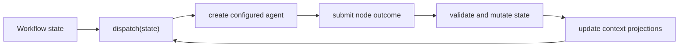
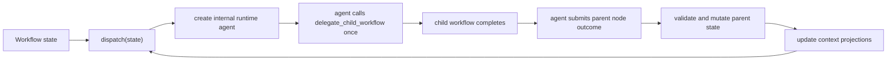

# Workflow Graph and Node Design

Status: design draft.

This document defines the workflow graph and node model for `eos-coding-agent`.
It is grounded in the current Pursuit workflow shape, where planner and worker
agents submit terminal outcome tools and those outcome handlers validate and
mutate workflow state.

## Goal

Represent a workflow as a graph of named nodes plus typed state. The dispatcher
reads state, launches runnable nodes, and advances only when a launched node
completes through a validated terminal outcome function.

The model should support:

- Agent-backed nodes.
- Workflow-backed nodes.
- Workflow-local state such as booleans, numbers, strings, lists, and objects.
- Deterministic host-side state mutation after each node completion.
- Explicit dispatch and deadlock detection.
- Context store wiring for node-specific context reads.
- Multiple configured instances of the same workflow type.

## Core Decisions

| Topic | Decision |
| --- | --- |
| Workflow identity | `name` is the configured workflow instance. `type` selects the workflow implementation, such as `pursuit`. |
| Graph definition | `nodes` is a first-level workflow config field. It is not nested under `args`. |
| Runtime knobs | `args` is for workflow metadata and knobs such as max attempts, context scripts, store paths, and custom settings. |
| Definition source | The workflow definition is written in the workflow markdown file. Frontmatter carries machine-readable fields; the markdown body carries instructions and examples. |
| Public workflow tools | Workflows do not directly provide per-workflow tools. Agents use generic workflow tools such as `delegate_workflow`, `list_workflow_definitions`, `list_workflow_context`, and `query_workflow_context`. |
| Node implementation | Each node points to either an agent profile or another workflow. |
| No target field | The workflow implementation owns the meaning of each node and how prompts are built. Config does not need a separate `target`. |
| No adapter agent | Workflow-backed nodes are wrapped by an internal runtime agent. The user does not configure an adapter. |
| Outcome boundary | Each node has a workflow-owned terminal outcome function, such as `plannerOutcome` or `workerOutcome`. |
| State mutation | The terminal outcome function validates the submitted outcome and commits the state transaction. |
| Dispatcher | `dispatch(state)` is host-side code. It reads state and node config, then launches runnable nodes. |
| Deadlock | `deadlock(state)` is true when the workflow is not terminal, no node or child workflow is running, and a dispatch pass launches nothing. |
| Context | `context_store` is a first-class runtime surface. Config may place its paths and scripts under `args`. |

## Config Shape

Each workflow is defined by a `workflow.md` file. This keeps the workflow easy
to author and review:

- YAML frontmatter is the machine-readable workflow definition.
- The markdown body is the human and agent-readable workflow docstring.
- Long examples can live in the markdown body.
- The loader exposes the parsed definition through `list_workflow_definitions()`.

The first-level `nodes` field defines the graph slots that this workflow
instance can launch. The workflow `type` implementation defines which node
names are meaningful and which outcome function each node uses.

```yaml
---
name: pursuit_1
type: pursuit
description: Delegate a multi-leg coding pursuit.
nodes:
  planner:
    agent: pursuit-planner
  worker:
    agent: pursuit-worker
definition:
  delegate_args_schema:
    type: object
    required: [goal]
    properties:
      goal:
        type: string
      max_attempts:
        type: integer
        minimum: 1
  result_schema:
    type: object
    required: [status]
    properties:
      status:
        type: string
        enum: [success, failure]
  context_query_schema:
    type: object
    properties:
      node:
        type: string
        enum: [planner, worker]
      layer:
        type: string
        enum: [l1, l2, l3]
      keyword:
        type: string
      path:
        type: string
      line:
        type: integer
args:
  store: .eos-agents/workflows/pursuit/store
  context_root: .eos-agents/workflows/pursuit/context
  context_scripts:
    planner: .eos-agents/workflows/pursuit/scripts/planner.cjs
    worker: .eos-agents/workflows/pursuit/scripts/worker.cjs
  default_max_attempts: 2
---

Markdown body documents the workflow's purpose, expected behavior, examples,
and context query guidance.
```

A node may also point to a workflow:

```yaml
---
name: pursuit_with_workflow_worker
type: pursuit
nodes:
  planner:
    agent: pursuit-planner
  worker:
    workflow: coding_worker_pursuit
args:
  default_max_attempts: 2
  context_scripts:
    planner: .eos-agents/workflows/pursuit/scripts/planner.cjs
    worker: .eos-agents/workflows/pursuit/scripts/worker.cjs
---
```

The workflow implementation still treats the node as `worker`. The only
difference is how the dispatcher launches the node.

## Node Model

A node is a dispatch slot, not a free-form behavior definition.

```ts
type WorkflowNodeRef =
  | { agent: string }
  | { workflow: string };

type WorkflowConfig = {
  name: string;
  type: string;
  description?: string;
  nodes: Record<string, WorkflowNodeRef>;
  definition: WorkflowDefinition;
  args: Record<string, unknown>;
};

type WorkflowDefinition = {
  delegate_args_schema: JsonSchema;
  result_schema: JsonSchema;
  context_query_schema: JsonSchema;
};
```

For a `pursuit` workflow, the implementation owns this mapping:

| Node name | Required | Launches | Terminal outcome function |
| --- | --- | --- | --- |
| `planner` | Yes | Agent or workflow wrapper | `plannerOutcome` / `submit_planner_outcome` |
| `worker` | Yes | Agent or workflow wrapper | `workerOutcome` / `submit_worker_outcome` |

For a `ralplan`-style workflow, the implementation might own:

| Node name | Required | Launches | Terminal outcome function |
| --- | --- | --- | --- |
| `planner` | Yes | Agent or workflow wrapper | `plannerOutcome` |
| `architect` | Yes | Agent or workflow wrapper | `architectOutcome` |
| `critic` | Yes | Agent or workflow wrapper | `criticOutcome` |

Config can choose which profile backs each node. Config cannot invent new node
semantics unless the workflow implementation has a handler for that node.

## Launch Semantics

Agent-backed node:



Workflow-backed node:



The workflow-backed node does not need explicit workflow input and output
converter agents. The dispatcher creates an internal agent with a narrow prompt:

1. Read the parent node assignment and context.
2. Call `delegate_workflow(name, args)` for the configured child workflow
   exactly once.
3. Wait for or read the child workflow result.
4. Optionally ask an advisor if the parent workflow allows it.
5. Submit the parent node's required terminal outcome tool.

The internal agent is an implementation detail. It should not appear as
`adapter_agent` in the workflow config.

## Public Workflow Tool Surface

Workflow instances should not register public tools such as
`delegate_pursuit_1` or `delegate_replan_1`. The public surface should be small
and generic:

```ts
delegate_workflow(name: string, args: JsonObject): Promise<WorkflowRunRef>;

list_workflow_definitions(): Promise<WorkflowDefinitionSummary[]>;

list_workflow_context(workflow_id: string): Promise<WorkflowContextIndex>;

query_workflow_context(workflow_id: string, args: JsonObject): Promise<WorkflowContextResult>;
```

The agent can use `args: JsonObject` effectively only if the workflow markdown
definition exposes schemas and examples. `list_workflow_definitions()` should
return the parsed schema from `workflow.md`, not only prose:

```ts
type WorkflowDefinitionSummary = {
  name: string;
  type: string;
  description?: string;
  delegate_args_schema: JsonSchema;
  result_schema: JsonSchema;
  context_query_schema: JsonSchema;
  nodes: Record<string, WorkflowNodeRef>;
};
```

This gives agents a stable universal workflow interface while keeping
workflow-specific validation in the host implementation.

## Outcome And State Mutation

The terminal outcome function is the transaction boundary.

For Pursuit today, planner and worker outcome handlers already do this job:

- Validate the submitted JSON shape.
- Validate semantic constraints.
- Reject impossible or illegal submissions.
- Mutate the workflow state.
- Update launch queues and context projections.
- Decide whether the workflow is still running, complete, failed, blocked, or
  ready for another attempt or leg.

This design keeps that ownership. There is no separate generic
`state_update(nodeOutcome, state)` layer in the first version. A generic layer
can be introduced later only if several workflow implementations converge on
the same transition contract.

Validation should include:

- The node that submitted is actually running.
- The submitted outcome matches the node's required contract.
- Dependency edges reference known work item IDs.
- Dependency cycles are rejected.
- The outcome is legal for the current leg and attempt.
- Retry and leg-relay limits are enforced.
- Context writes stay inside the workflow context store.

## Dispatcher

The dispatcher is coded host logic, not an LLM decision.

For Pursuit, a dispatch pass should roughly follow this priority:

1. If the workflow is terminal, launch nothing.
2. If a planner is required and no planner is running, launch the `planner`
   node.
3. If the planner has produced ready work items, launch eligible `worker` nodes.
4. If all work for the attempt is settled and failures exist, advance retry
   state and launch a new planner when attempts remain.
5. If the attempt succeeds and `next_leg_goal` exists, relay to the next leg and
   launch a new planner.
6. If the attempt succeeds and there is no next leg, mark the workflow complete.

Dispatcher inputs:

```ts
type DispatchInput = {
  workflowName: string;
  workflowType: string;
  nodes: Record<string, WorkflowNodeRef>;
  state: WorkflowState;
  contextStore: WorkflowContextStore;
};
```

Dispatcher output:

```ts
type DispatchCommand =
  | { kind: "launch_agent"; node: string; agent: string; prompt: string }
  | { kind: "launch_workflow_wrapper"; node: string; workflow: string; prompt: string };
```

The dispatcher may return multiple commands when the workflow supports parallel
workers. It must not mutate state directly except for narrow claim/lease fields
needed to prevent duplicate launches. Durable state changes still happen at
terminal outcome functions.

## Deadlock Detection

Deadlock is a runtime invariant check after dispatch.

```ts
function isDeadlocked(state: WorkflowState, running: RunningNodes, commands: DispatchCommand[]): boolean {
  return !state.terminal && running.count === 0 && commands.length === 0;
}
```

A deadlock means the state machine has no runnable node and no node that can
eventually complete. It is different from waiting:

| Condition | Meaning |
| --- | --- |
| Running node exists | Not deadlocked. Wait for completion or timeout. |
| Child workflow running | Not deadlocked. Wait for child completion or timeout. |
| Dispatch launches commands | Not deadlocked. Work was started. |
| Terminal success/failure | Not deadlocked. Workflow is complete. |
| Nonterminal, no running work, no dispatch commands | Deadlocked. |

Deadlock reports should include:

- Workflow name and type.
- Leg and attempt identifiers when present.
- Running node count.
- Planner-ready, worker-queue, blocked, failed, and succeeded counts.
- Last completed node and outcome kind.
- The dispatcher rule that was expected to match but did not.

## Context Store

The context store is a workflow runtime service. Nodes do not receive the whole
state by default. They receive a compact prompt plus read/search tools.

Required surface:

```ts
interface WorkflowContextStore {
  get_context(node: string, state: WorkflowState): Promise<NodeContext>;
  list_context_structure(): Promise<ContextEntry[]>;
  search_context(query: ContextSearchQuery): Promise<ContextSearchResult[]>;
}

type ContextSearchQuery =
  | { keyword: string }
  | { path: string; line?: number };
```

For Pursuit, this maps onto the current l1/l2/l3 context structure:

| Layer | Purpose | Dispatcher usage |
| --- | --- | --- |
| L1 | Immediate node assignment and current attempt facts | Included in launch prompt. |
| L2 | Workflow memory and compact prior outcomes | Included or referenced by node context. |
| L3 | Larger files, logs, traces, and artifacts | Available through search/read tools. |

Context projections should be updated after terminal outcome transactions, not
by arbitrary node code.

## Dependency And Workflow Cycle Validation

There are two cycle checks.

Work item dependency cycles are rejected by the node outcome validator. For
Pursuit, `submit_planner_outcome` must reject a planner result where work item
dependencies form a cycle.

Workflow dependency cycles are rejected before dispatch starts. The loader can
build a graph from configured workflow nodes:

```txt
pursuit_with_workflow_worker -> coding_worker_pursuit
coding_worker_pursuit -> verifier_pursuit
```

Then run DFS:

```ts
function assertNoWorkflowCycles(workflows: WorkflowConfig[]): void {
  const visiting = new Set<string>();
  const visited = new Set<string>();

  function visit(name: string): void {
    if (visiting.has(name)) throw new Error(`workflow cycle at ${name}`);
    if (visited.has(name)) return;

    visiting.add(name);
    for (const child of workflowNodeRefs(name)) visit(child);
    visiting.delete(name);
    visited.add(name);
  }

  for (const workflow of workflows) visit(workflow.name);
}
```

The first version should reject:

- A workflow node that references its own workflow instance.
- Any transitive cycle.
- Unknown agent profile names.
- Unknown workflow names.
- A node that specifies both `agent` and `workflow`.
- A node that specifies neither `agent` nor `workflow`.

## Pursuit State Factors

The dispatcher should depend on a bounded set of state factors. This keeps the
workflow inspectable and makes Monte Carlo simulation possible.

Likely Pursuit dispatcher factors:

| Factor | Shape | Dispatcher meaning |
| --- | --- | --- |
| `terminal` | boolean | Stop dispatch when true. |
| `leg_number` | number | Current leg identity. |
| `attempt_number` | number | Current retry identity. |
| `default_max_attempts` | number | Retry limit. |
| `planner_running` | boolean | Prevent duplicate planner launch. |
| `worker_running_count` | number | Parallel worker capacity and deadlock check. |
| `planner_ready` | boolean | Planner should be launched. |
| `current_attempt_work_items.length` | number | Work remains to dispatch. |
| `ready_work_items.length` | number | Workers can be launched. |
| `blocked_work_items.length` | number | Dependency failure or waiting. |
| `failed_work_items.length` | number | Attempt retry or final failure decision. |
| `succeeded_work_items.length` | number | Attempt completion decision. |
| `next_leg_goal` | string or null | Leg relay after successful attempt. |
| `context_projection_dirty` | boolean | Context projection must be refreshed before launch. |

Planner and worker outcomes are the random variables for simulation. Derived
values such as dependency density should not be treated as submitted outcome
events unless an actual outcome contract contains them.

## Migration Path From Current Pursuit

Current Pursuit args include direct `planner` and `worker` names:

```yaml
args:
  planner: pursuit-planner
  worker: pursuit-worker
```

The target shape moves those refs into top-level nodes:

```yaml
nodes:
  planner:
    agent: pursuit-planner
  worker:
    agent: pursuit-worker
args:
  default_max_attempts: 2
```

A compatibility transition can normalize old configs at load time:

```ts
function normalizePursuitConfig(config: WorkflowConfig): WorkflowConfig {
  if (config.type !== "pursuit") return config;
  if (config.nodes) return config;

  return {
    ...config,
    nodes: {
      planner: { agent: String(config.args.planner) },
      worker: { agent: String(config.args.worker) },
    },
    args: omit(config.args, ["planner", "worker"]),
  };
}
```

That compatibility path should be temporary. New workflow docs should use
top-level `nodes`.

## Implementation Boundary

The workflow hub should own config loading, node reference validation, profile
resolution, workflow cycle detection, and the generic workflow tool surface.

The workflow markdown file should own the editable workflow definition:

- `name`
- `type`
- `description`
- `nodes`
- `definition.delegate_args_schema`
- `definition.result_schema`
- `definition.context_query_schema`
- `args`
- Markdown instructions and examples

The workflow implementation should own:

- Required node names.
- Node prompt construction.
- Terminal outcome functions.
- State schema.
- Dispatch rules.
- Deadlock diagnostics.
- Context projection rules.

The agent runtime should own:

- Creating an agent for an agent-backed node.
- Creating the internal runtime agent for a workflow-backed node.
- Restricting visible tools for workflow-backed nodes so the agent can call the
  intended `delegate_workflow(name, args)` call and the required terminal
  outcome tool.

This keeps workflow behavior explicit in host code while still allowing nodes
to be backed by either agents or nested workflows.
